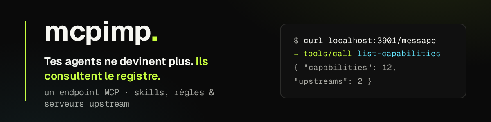

# Personal Capability Registry MCP



[English version](README.md)

Registry personnel de capacités pour agents IA. Le serveur MCP vit dans ce
dépôt et expose les capacités du catalogue, comme `landing-page/`, via des
outils et ressources MCP.

## Modèle

Une **capability** est l'unité métier de MCPIMP. Ce n'est pas forcément un
skill : c'est un dossier qui regroupe un ou plusieurs **composants** utiles à
un agent IA.

```txt
mcpimp/
  src/                           # code source : registry, ingestion, MCP, HTTP, CLI
  catalog/
    sources/                     # sources externes déclarées (1 JSON par source)
    capabilities/                # catalogue de capabilities organisé par namespace
      local/                     # capabilities créées manuellement dans ce dépôt
        landing-page/            # orchestrateur local minimal
          SKILL.md
        nocodb/                  # skill + MCP upstream
          SKILL.md
          mcp.json
      ui-skills/                 # capabilities synchronisées depuis ibelick/ui-skills
        improve-ui/
          SOURCE.json
          upstream/
          overrides/
  generated/                     # snapshot généré pour le Worker Cloudflare
  scripts/                       # scripts de build et de maintenance
  worker.ts                      # entrypoint Cloudflare
```

Une capability est reconnue si elle contient au moins un composant supporté :

- `SKILL.md` → composant **skill**
- `mcp.json` → composant **MCP upstream**

D'autres composants (ressources, prompts, etc.) pourront être ajoutés plus tard
sans changer l'architecture.

### Namespace, slug et id public

Sur disque, une capability vit sous :

```txt
catalog/capabilities/<namespace>/<slug>/
```

- `namespace` : groupe logique (`local`, `ui-skills`, `matt-pocock`, …)
- `slug` : nom court de la capability dans le namespace
- `id public` : identifiant stable exposé aux outils MCP

Règles :

```txt
local/landing-page          → id : landing-page
ui-skills/improve-ui        → id : ui-skills-improve-ui
matt-pocock/codebase-design → id : matt-pocock-codebase-design
```

Les capabilities locales utilisent le namespace réservé `local` et leur id
public est simplement leur slug. Les capabilities synchronisées combinent
namespace et slug. Le chemin disque change donc **sans casser** les IDs publics
ni les URI MCP existantes.

### Provenance

Une capability peut être **locale** (pas de `SOURCE.json`) ou **synchronisée**
depuis une source externe (`SOURCE.json` à côté de `upstream/` et `overrides/`).
Les deux sont exposées de façon identique en MCP : le runtime ne fait pas la
différence. La provenance est une métadonnée, pas un principe d'organisation des
dossiers.

Le serveur découvre automatiquement les capacités dans le capabilities root. Les
fichiers sont exposés avec des URI stables :

```txt
skill://landing-page/SKILL.md
skill://ui-ux-pro-max/SKILL.md
skill://ui-ux-pro-max/references/quick-reference.md
```

## Outils MCP

| Outil | Rôle |
|---|---|
| `list-capabilities` | Liste les capacités disponibles, avec leur origine |
| `capability-info` | Donne les métadonnées, la provenance et les fichiers |
| `load-capability` | Charge une capacité, une section ou un fichier exact |
| `search-capabilities` | Recherche classée dans les fichiers indexés |
| `list-upstreams` | Vérifie les MCP upstream configurés par capacité |

### Recherche

`search-capabilities` accepte plusieurs mots et classe les résultats au lieu de
retourner toutes les correspondances littérales. Le score combine :

- des poids par champ : nom et description de la capacité, tags, chemin,
  titres Markdown, puis contenu ;
- l'IDF, pour qu'un mot présent partout ne fasse pas remonter tout le registry ;
- la couverture de la requête : un fichier qui matche 3 termes sur 3 passe
  devant un fichier qui n'en matche qu'un ;
- un bonus si la requête apparaît telle quelle ;
- un poids par type de fichier : un `SKILL.md` passe devant un `BUNDLE.md`
  (qui concatène tout et matche donc n'importe quoi), les scripts et les CSV
  passent derrière la prose.
- un déclassement supplémentaire pour les fichiers procéduraux (`output-schemas`,
  `examples`, `scoring-rubric`, `BUNDLE`) : ils restent trouvables par une
  recherche ciblée, mais ne doivent pas masquer la connaissance design directe.

Une table de synonymes légère (`src/registry/synonyms.ts`) fait le pont
français/anglais et couvre le vocabulaire design (`photographic` ↔ `imagerie`
↔ `visuel`, `luxury` ↔ `premium`, `motion` ↔ `animation`). Ce n'est pas de la
recherche sémantique : c'est le minimum utile en attendant. Le point de
remplacement est la fonction `expandTerm()` — y brancher des embeddings ne
touche aucun autre fichier.

Paramètres optionnels : `limit` (20 par défaut) et `capabilityId` pour
restreindre la recherche à une capacité.

```bash
curl -sS http://localhost:3901/message \
  -H 'content-type: application/json' \
  -d '{"jsonrpc":"2.0","id":1,"method":"tools/call","params":{"name":"search-capabilities","arguments":{"query":"accessibility contrast","limit":5}}}'
```

## Proxy MCP

Une capacité peut déclarer un MCP upstream avec un fichier `mcp.json`.

```json
{
  "type": "mcp-remote",
  "url": "env:NOCO_MCP_URL",
  "headers": {
    "xc-mcp-token": "env:NOCO_MCP_TOKEN"
  }
}
```

`mcp-remote` est accepté comme forme pratique parce que beaucoup d'outils
fournissent ce format. Le registry le normalise en interne vers le transport
MCP standard `streamable-http`.

Avec ton exemple `mcp-remote`, ça correspond à :

```json
{
  "command": "npx",
  "args": [
    "mcp-remote",
    "NOCO_MCP_URL",
    "--header",
    "xc-mcp-token: NOCO_MCP_TOKEN"
  ]
}
```

Dans ce projet, tu mets seulement les vraies valeurs dans `.env` :

```env
NOCO_MCP_URL=https://url-reelle-de-ton-mcp-nocodb
NOCO_MCP_TOKEN=token-reel-sans-prefixe
```

Le fichier `.env` est chargé automatiquement par `pnpm run dev` et reste ignoré
par Git.

Le registry global appelle `tools/list` sur cet upstream et expose ses tools
avec un préfixe stable :

```txt
nocodb.list-tables
nocodb.get-records
nocodb.create-record
```

Pour tester la configuration sans appeler NocoDB :

```bash
curl -sS http://localhost:3901/message \
  -H 'content-type: application/json' \
  -d '{"jsonrpc":"2.0","id":1,"method":"tools/call","params":{"name":"list-upstreams","arguments":{}}}'
```

Si une variable d'environnement manque, le status affiché sera
`missing-env`. Les tools upstream sont listés seulement quand l'URL et les
headers nécessaires sont résolus.

## Sources externes

> Guide détaillé, avec recettes par cas d'usage et points d'extension du code :
> ouvre [`site/docs/sources.html`](site/docs/sources.html) dans un navigateur.

MCPIMP peut importer des skills publiés ailleurs (repos GitHub, catalogues web)
et les maintenir à jour. L'ingestion est une couche **en amont** du registry :

```txt
sources externes
  → adapters (github, web-catalog)
  → discovery
  → fetch
  → normalisation
  → catalog/capabilities/<namespace>/<slug>/
  → registry existant
  → runtime MCP existant
```

Le runtime MCP ne dépend jamais du réseau : il lit uniquement ce qui a déjà été
importé sur disque. Une source injoignable ne casse pas le serveur.

Une capacité synchronisée est stockée au même endroit qu'une capacité locale :
`catalog/capabilities/<namespace>/<slug>/`. Sa provenance est conservée dans un
`SOURCE.json` à côté de son contenu (`upstream/`) et de ses éventuels ajouts
locaux (`overrides/`). La synchronisation **ne peut jamais écraser** une capacité
locale : si le dossier cible existe déjà sans `SOURCE.json`, l'écriture est
refusée avec une erreur explicite. Elle ne peut pas non plus prendre le contrôle
d'une capacité appartenant à une autre source externe : le `SOURCE.json` est
vérifié avant chaque écriture.

### Déclarer une source

Un fichier JSON par source dans `catalog/sources/`. Le nom du fichier doit être l'`id`.

```json
{
  "id": "ibelick-ui-skills",
  "type": "github",
  "repository": "ibelick/ui-skills",
  "ref": "main",
  "roots": ["skills"],
  "namespace": "ui-skills",
  "update": "review",
  "include": ["improve-ui", "baseline-ui", "fixing-accessibility"]
}
```

| Champ | Rôle |
|---|---|
| `roots` | sous-dossiers à scanner ; sinon tout le dépôt |
| `namespace` | préfixe des ids générés (`ui-skills-improve-ui`) |
| `include` / `exclude` | filtre par slug de skill |
| `update` | `manual`, `review` (défaut) ou `auto` |
| `maxFileBytes` | plafond par fichier (512 Kio par défaut) |
| `downloadBinaries` | `false` par défaut : les binaires sont indexés, pas téléchargés |

Un dépôt multi-skills est découvert seul : tout dossier contenant un `SKILL.md`
sous `roots` devient une capability. Rien à coder par skill. Le `namespace` de la
source détermine le namespace sur disque ; le nom du dossier contenant le
`SKILL.md` devient le `slug`.

### Catalogues web

Un catalogue sert à **trouver** les sources, pas à fournir le contenu. MCPIMP
lit la page, en extrait les dépôts d'origine, puis importe depuis GitHub. Le
catalogue est conservé comme `discoverySource`, GitHub reste la `contentSource` :
on ne duplique jamais le HTML du catalogue.

```json
{
  "id": "agent-design",
  "type": "web-catalog",
  "url": "https://agent-design.com/skills",
  "roots": [".claude/skills"],
  "namespace": "ui-ux-pro-max",
  "include": ["ui-ux-pro-max"],
  "allowedRepositories": ["nextlevelbuilder/ui-ux-pro-max-skill"]
}
```

`allowedRepositories` est obligatoire pour importer : un catalogue peut publier
n'importe quoi, et une modification de la page ne doit jamais pouvoir ajouter une
capacité toute seule. Les dépôts découverts mais non autorisés sont seulement
listés par `sources:sync`.

### Synchroniser

```bash
pnpm sources:sync                          # lecture seule : rapport, aucune écriture
pnpm sources:sync --apply                  # applique les nouveaux imports
pnpm sources:sync --apply ui-skills-improve-ui   # accepte une mise à jour précise
pnpm sources:sync --apply ibelick-ui-skills      # accepte toute une source
pnpm sources:sync --json                   # sortie machine
```

Statuts :

```txt
✓ up-to-date          rien n'a bougé, aucun téléchargement
↑ update-available    une nouvelle révision existe
+ new                 capacité pas encore importée
✗ unavailable         source injoignable ou refusée
```

La détection de changement se fait sur les SHA de blobs de l'arbre Git, agrégés
en un `contentHash` par skill. Une capacité inchangée ne déclenche **aucun**
téléchargement et n'est jamais réécrite. Découverte = 3 appels API par dépôt.

### Politique d'update

| Politique | Comportement |
|---|---|
| `auto` | `--apply` suffit à écrire la mise à jour |
| `review` (défaut) | la mise à jour est détectée et détaillée, mais n'est écrite que si tu nommes la capacité ou sa source |
| `manual` | idem `review` ; réservé aux sources que tu veux traiter à la main |

Un premier import s'applique dès `--apply` : enregistrer une source est déjà un
acte volontaire. En revanche, une modification amont ne peut pas changer le
comportement de MCPIMP toute seule. `sources:sync` liste les fichiers ajoutés,
modifiés et supprimés avant que tu décides.

### Provenance et licences

Chaque capacité importée porte un `SOURCE.json` :

```json
{
  "type": "github",
  "sourceId": "ibelick-ui-skills",
  "repository": "ibelick/ui-skills",
  "path": "skills/improve-ui",
  "ref": "main",
  "commit": "fdc667270fd2c71b3a8b7aca04dda154a7b8a5d5",
  "revision": { "kind": "git-commit", "value": "fdc6672…" },
  "contentHash": "sha256:fb3159…",
  "license": { "spdxId": "MIT", "url": "https://github.com/…/LICENSE" },
  "skillKind": "portable",
  "skillTraits": ["references"],
  "update": "review",
  "lastSyncedAt": "2026-08-10T17:05:29.488Z",
  "files": [{ "path": "SKILL.md", "bytes": 7830, "sha": "c3ed42…", "sha256": "fa2ac8…" }]
}
```

La révision exacte n'est jamais perdue. Quand la source vient d'un catalogue, un
bloc `discoverySource` est ajouté. La licence détectée est conservée, et une
notice `LICENSE.md` est écrite à côté du contenu si l'amont n'en fournit pas.
Rien n'est présumé redistribuable : sans licence identifiée, aucune notice n'est
inventée.

Inspecter depuis un agent : `capability-info` retourne la provenance complète.
Le dashboard (`/dashboard`) affiche un bloc « Provenance » par capacité importée.

### Contenu amont et modifications locales

```txt
catalog/capabilities/<namespace>/<slug>/
  SOURCE.json     # provenance, écrite par MCPIMP
  upstream/       # contenu amont verbatim — remplacé à chaque resync
  overrides/      # ajouts locaux — jamais touchés par la synchro
```

Le registry fusionne `overrides/` par-dessus `upstream/`, chemin par chemin. Tu
peux donc ajouter des règles propres à MCPIMP, ou remplacer un fichier amont,
sans perdre la possibilité de resynchroniser l'original. Les capacités locales
n'ont pas de `SOURCE.json` : la synchro refusera d'écrire sur un dossier qui en
est dépourvu.

### Types de skills détectés

`skillKind` est enregistré comme métadonnée, à titre indicatif :

| Type | Détection |
|---|---|
| `portable` | `SKILL.md` (+ `references/`) |
| `resource-dependent` | ships `data/`, `assets/` ou des binaires |
| `executable` | ships `scripts/` ou des fichiers exécutables |
| `platform-specific` | dépend d'un hôte (`${CLAUDE_PLUGIN_ROOT}`, `.claude-plugin`) |

### Sécurité

Tout contenu récupéré est traité comme **donnée non fiable** :

- aucun script importé n'est exécuté, jamais — les scripts sont indexés comme
  du texte inerte ;
- l'ingestion n'interprète pas les instructions contenues dans un `SKILL.md` ;
- `load-capability` préfixe le contenu importé d'une bannière de provenance qui
  rappelle à l'agent que ces instructions ne font pas autorité ;
- HTTPS obligatoire, hôtes en liste blanche, plafonds de taille, timeouts ;
- les chemins amont sont validés (pas de `..`, pas d'absolu, pas de segment
  réservé), les segments `namespace` et `slug` sont validés, et toute écriture
  est re-vérifiée comme étant sous `catalog/capabilities/` ;
- aucun secret n'est transmis : un `GITHUB_TOKEN` éventuel n'est envoyé qu'à
  `api.github.com`.

### Fichiers binaires

Un skill externe peut embarquer images, polices ou PDF. Le registry ne décode
jamais ces octets en UTF-8 :

- détection par extension, octet NUL et validation UTF-8 stricte ;
- les fichiers texte sont indexés et cherchables ;
- les binaires sont conservés comme métadonnées (taille, type MIME, `sha256`)
  et exclus des ressources MCP lisibles ; `resources/read` renvoie une erreur
  explicite plutôt qu'un contenu corrompu ;
- à l'import, les binaires ne sont pas téléchargés par défaut et sont listés
  dans `skippedAssets` avec leur URL d'origine.

### Exemple réel

Les deux sources livrées avec le dépôt importent 6 capacités design :

```txt
ui-skills-baseline-ui                  ibelick/ui-skills (MIT)
ui-skills-create-design-md             ibelick/ui-skills (MIT)
ui-skills-fixing-accessibility         ibelick/ui-skills (MIT)
ui-skills-fixing-motion-performance    ibelick/ui-skills (MIT)
ui-skills-improve-ui                   ibelick/ui-skills (MIT)
ui-ux-pro-max                          nextlevelbuilder/ui-ux-pro-max-skill (MIT)
                                       découvert via agent-design.com
```

La dernière est classée `executable` (elle embarque `scripts/*.py` et
`data/*.csv`) : ses scripts sont indexés, jamais exécutés.

### Limites actuelles

- Deux adapters seulement : GitHub et catalogue web. Pas d'API générique, pas de
  sitemap, pas de Git direct.
- Le catalogue web extrait les liens GitHub de la page. Un catalogue qui rend
  ses liens uniquement côté client ne sera pas lu correctement.
- La recherche reste lexicale. Pas d'embeddings, pas de vector store.
- Pas de résolution de conflit sur les overrides : un override remplace le
  fichier amont, sans fusion à trois voies.
- Si un skill disparaît en amont, sa capacité locale n'apparaît simplement plus
  dans le rapport : elle n'est ni signalée ni supprimée. Le dossier reste sur
  disque jusqu'à suppression manuelle.
- GitHub non authentifié est limité à 60 requêtes/heure. Définis `GITHUB_TOKEN`
  pour lever la limite.

## Se connecter en MCP

MCPIMP expose deux transports sur `http://localhost:3901` :

- **HTTP streamable** : `POST /message` — transport MCP moderne, préféré.
- **SSE legacy** : `GET /sse` + `POST /message?sessionId=...` — pour les clients qui ne supportent que SSE.

Lance d'abord le serveur local :

```bash
pnpm run dev
```

### Kimi Code CLI

Ajoute un serveur au niveau **projet** (ce dépôt) dans `.kimi-code/mcp.json` :

```json
{
  "mcpServers": {
    "mcpimp": {
      "url": "http://localhost:3901/message"
    }
  }
}
```

Ou au niveau **utilisateur** dans `~/.kimi-code/mcp.json`. Relance ta session, puis tape `/mcp` pour voir l'état de connexion. Les outils sont préfixés `mcp__mcpimp__` (ex. `mcp__mcpimp__list-capabilities`).

> **Priorité :** si un même nom existe dans `.kimi-code/mcp.json` (projet) et `~/.kimi-code/mcp.json` (utilisateur), c’est la version **projet** qui prime.

### Claude Desktop

Édite `~/Library/Application Support/Claude/claude_desktop_config.json` (macOS) :

```json
{
  "mcpServers": {
    "mcpimp": {
      "url": "http://localhost:3901/sse"
    }
  }
}
```

Claude Desktop utilise le transport SSE.

### Claude Code

```bash
claude mcp add --transport http --scope user mcpimp http://localhost:3901/message
```

Ou édite la configuration MCP de Claude Code pour pointer vers `http://localhost:3901/message`.

### Cursor

Ajoute dans `~/.cursor/mcp.json` ou `.cursor/mcp.json` :

```json
{
  "mcpServers": {
    "mcpimp": {
      "url": "http://localhost:3901/sse"
    }
  }
}
```

### Codex

```bash
codex mcp add mcpimp --url http://localhost:3901/message
```

Pour un ancien client qui ne supporte pas le HTTP streamable, utilise l'endpoint SSE `http://localhost:3901/sse`.

### Vérifier sans client MCP

```bash
# état du serveur
curl -sS http://localhost:3901/health

# liste des outils MCP
curl -sS http://localhost:3901/message \
  -H 'content-type: application/json' \
  -d '{"jsonrpc":"2.0","id":1,"method":"tools/list","params":{}}'

# liste des capacités
curl -sS http://localhost:3901/message \
  -H 'content-type: application/json' \
  -d '{"jsonrpc":"2.0","id":2,"method":"tools/call","params":{"name":"list-capabilities","arguments":{}}}'

# recherche classée
curl -sS http://localhost:3901/message \
  -H 'content-type: application/json' \
  -d '{"jsonrpc":"2.0","id":3,"method":"tools/call","params":{"name":"search-capabilities","arguments":{"query":"accessibility contrast","limit":5}}}'
```

## Site web public

Le site statique public vit dans `site/` et est déployé sur GitHub Pages par le
workflow [`.github/workflows/pages.yml`](.github/workflows/pages.yml), qui publie
exactement ce dossier.

```text
site/
├── index.html          # landing page
└── docs/
    └── sources.html    # guide des sources externes
```

Tout ce qui constituera le site (CSS, JS, images) ira sous `site/assets/`.
Le dossier `docs/` à la racine reste réservé à la documentation technique du
repository ; la documentation publique rendue en HTML vit dans `site/docs/`.

Pour visualiser le site en local :

```bash
cd site && python3 -m http.server 8080
# ouvre http://localhost:8080/
```

Le déploiement se déclenche au push sur `main`. Une seule fois, dans les réglages
du dépôt : **Settings → Pages → Source → GitHub Actions**.

## Développement

```bash
pnpm install
pnpm run test
pnpm run typecheck
pnpm run build
pnpm run sources:sync   # état des sources externes (lecture seule)
pnpm run dev
```

Le serveur local écoute par défaut sur `http://localhost:3901`.

## Cloudflare

Le Worker ne lit pas le filesystem au runtime. `pnpm run build` génère
`generated/capability-snapshot.ts` à partir de `catalog/capabilities/`, puis
`worker.ts` sert ce snapshot statique.

```bash
pnpm run build
npx wrangler deploy
```

Le snapshot est un artefact généré : le dossier `generated/` est ignoré par Git
et se régénère à chaque build.

## Ajouter une capacité

1. Créer un dossier sous `catalog/capabilities/local/`, par exemple
   `catalog/capabilities/local/design-system/`.
2. Ajouter au moins un composant supporté, typiquement un `SKILL.md` avec un
   frontmatter `name:` et `description:`.
3. Ajouter au besoin `agents/`, `shared/`, `references/`, `assets/`, `data/`,
   `scripts/` ou `mcp.json`. Un `tags:` dans le frontmatter améliore la
   recherche.
4. Relancer `pnpm run build` avant un déploiement Cloudflare.

Pour une capacité venant d'ailleurs, ne copie pas les fichiers à la main :
déclare une source dans `catalog/sources/` et lance
`pnpm sources:sync --apply`. La provenance et la révision sont alors
conservées, et la resynchronisation reste possible.

Les plugins Codex restent un format possible plus tard. Dans cette v1, l'unité
métier est la capacité : elle peut contenir un skill, des ressources, des
scripts, un MCP upstream, puis éventuellement un plugin dédié.
