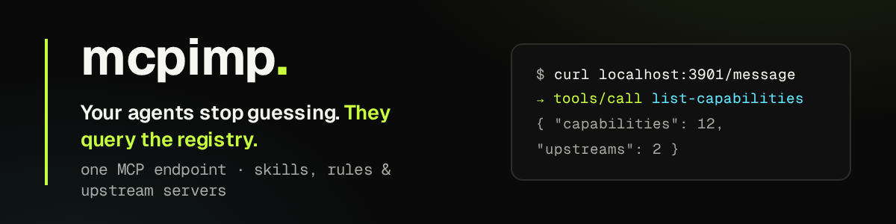

# Personal Capability Registry MCP



[Version française](README.fr.md)

MCPIMP is a personal capability registry for AI agents. This repository hosts
the MCP server and exposes the catalog's capabilities—such as
`landing-page/`—through MCP tools and resources.

MCPIMP is a capability intelligence and distribution layer, not an agent
framework or workflow engine. It helps an agent or its harness find a
capability and progressively load useful context; the calling harness remains
responsible for planning, execution, retries, and session management.

## Model

A **capability** is MCPIMP's domain unit. It is not necessarily a skill: it is
a directory that groups one or more components useful to an AI agent.

```txt
mcpimp/
  src/                           # registry, ingestion, MCP, HTTP, and CLI source code
  catalog/
    sources/                     # declared external sources (one JSON file per source)
    capabilities/                # capability catalog organised by namespace
      local/                     # capabilities created manually in this repository
      <namespace>/               # capabilities synchronised from external sources
  generated/                     # Cloudflare Worker snapshot generated at build time
  scripts/                       # build and maintenance scripts
  worker.ts                      # Cloudflare entry point
```

A capability is recognised when it contains at least one supported component:

- `SKILL.md` — a **skill** component
- `mcp.json` — an **upstream MCP** component

Other components—resources, prompts, and so on—can be added later without
changing the architecture.

### Namespace, slug, and public ID

On disk, a capability lives at:

```txt
catalog/capabilities/<namespace>/<slug>/
```

- `namespace`: a logical group (`local`, `ui-skills`, `matt-pocock`, …)
- `slug`: the capability's short name within its namespace
- `public ID`: the stable identifier exposed through MCP tools

```txt
local/landing-page          → ID: landing-page
ui-skills/improve-ui        → ID: ui-skills-improve-ui
matt-pocock/codebase-design → ID: matt-pocock-codebase-design
```

Local capabilities use the reserved `local` namespace and their public ID is
their slug. Synced capabilities combine namespace and slug, so disk paths can
change without breaking public IDs or existing MCP URIs.

### Provenance

A capability is either **local** (no `SOURCE.json`) or **synced** from an
external source (`SOURCE.json` beside `upstream/` and `overrides/`). Both are
exposed identically through MCP; provenance is metadata, not an organising
principle.

The server discovers capabilities automatically and exposes their files through
stable URIs, for example:

```txt
skill://landing-page/SKILL.md
skill://ui-ux-pro-max/SKILL.md
skill://ui-ux-pro-max/references/quick-reference.md
```

## MCP tools

| Tool | Purpose |
|---|---|
| `list-capabilities` | Lists available capabilities and their origin |
| `capability-info` | Returns metadata, provenance, and files |
| `load-capability` | Loads a capability, section, or exact file |
| `search-capabilities` | Searches indexed files and ranks results |
| `list-upstreams` | Checks configured upstream MCP servers |

`search-capabilities` supports multiple words and ranks results using field
weights, IDF, query coverage, exact-query bonuses, file-type weights, and a
resource-intent boost for queries asking for references or inspiration. It also
includes a light French/English synonym table in
`src/registry/synonyms.ts`. Global search returns a shortlist of eight
capabilities by default, with the best matching file for each one. Then use
`capabilityId` to search several internal files within the selected capability.
The optional `limit` parameter adjusts the maximum shortlist size.
Set `diagnostic: true` to include score components: coverage, terms and IDF,
matched fields, file weight, resource intent, and phrase bonus. Diagnostics are
omitted by default to keep normal responses compact.

```bash
curl -sS http://localhost:3901/message \
  -H 'content-type: application/json' \
  -d '{"jsonrpc":"2.0","id":1,"method":"tools/call","params":{"name":"search-capabilities","arguments":{"query":"accessibility contrast","limit":5}}}'
```

## Upstream MCP proxy

A capability may declare an upstream MCP in `mcp.json`:

```json
{
  "type": "mcp-remote",
  "url": "env:NOCO_MCP_URL",
  "headers": { "xc-mcp-token": "env:NOCO_MCP_TOKEN" }
}
```

`mcp-remote` is normalised internally to the standard streamable HTTP MCP
transport. Put real values only in `.env`; it is loaded by `pnpm run dev` and is
ignored by Git. Upstream tools receive a stable prefix, for example
`nocodb.list-tables` and `nocodb.get-records`.

## External sources

> For the detailed guide, use [`site/docs/sources.html`](site/docs/sources.html)
> in a browser.

MCPIMP imports skills published elsewhere (GitHub repositories and web
catalogues) and keeps them up to date. The runtime never depends on the
network: it reads only content already imported to disk.

Declare one JSON file per source under `catalog/sources/`; its filename must
match its `id`:

```json
{
  "id": "ibelick-ui-skills",
  "type": "github",
  "repository": "ibelick/ui-skills",
  "ref": "main",
  "roots": ["skills"],
  "namespace": "ui-skills",
  "update": "review",
  "include": ["improve-ui", "baseline-ui", "fixing-accessibility"]
}
```

| Field | Purpose |
|---|---|
| `roots` | Directories to scan; otherwise the whole repository |
| `namespace` | Prefix for generated IDs (`ui-skills-improve-ui`) |
| `include` / `exclude` | Filters by skill slug |
| `update` | `manual`, `review` (default), or `auto` |
| `maxFileBytes` | Per-file limit (512 KiB by default) |
| `downloadBinaries` | `false` by default: binaries are indexed, not downloaded |

GitHub sources currently discover capability roots through `SKILL.md`. The
ingestion pipeline itself is capability-centric: content adapters return
capabilities with detected components, so adapters can sync skill-only, MCP-only,
or skill+MCP capabilities without forcing a `SKILL.md`.

Synchronise sources with:

```bash
pnpm sources:sync                              # read-only report
pnpm sources:sync --apply                      # imports new capabilities
pnpm sources:sync --apply ui-skills-improve-ui # accepts one update
pnpm sources:sync --apply ibelick-ui-skills    # accepts a whole source
pnpm sources:sync --json                       # machine-readable output
```

Imported content is stored as follows:

```txt
catalog/capabilities/<namespace>/<slug>/
  SOURCE.json     # provenance written by MCPIMP
  upstream/       # upstream content, replaced on each resync
  overrides/      # local additions, never touched by synchronisation
```

All retrieved content is treated as untrusted data: imported scripts are never
executed, upstream instructions are not interpreted during ingestion, paths and
hosts are validated, and no secret is forwarded except an optional
`GITHUB_TOKEN` to `api.github.com`.

## Connect through MCP

MCPIMP exposes two transports on `http://localhost:3901`:

- **Streamable HTTP**: `POST /message` — preferred modern MCP transport.
- **Legacy SSE**: `GET /sse` + `POST /message?sessionId=...` — for clients that
  only support SSE.

Start the local server first:

```bash
pnpm run dev
```

Use `http://localhost:3901/message` for streamable HTTP clients and
`http://localhost:3901/sse` for SSE-only clients. Current Codex and Claude Code
clients can connect directly:

```bash
codex mcp add mcpimp --url http://localhost:3901/message
claude mcp add --transport http --scope user mcpimp http://localhost:3901/message
```

Verify the server without an MCP client:

```bash
curl -sS http://localhost:3901/health
curl -sS http://localhost:3901/message \
  -H 'content-type: application/json' \
  -d '{"jsonrpc":"2.0","id":1,"method":"tools/list","params":{}}'
```

MCPIMP advertises concrete resources and therefore answers the standard
`resources/templates/list` client probe with an empty `resourceTemplates` list.
Non-standard probes such as `server/discover` intentionally receive JSON-RPC
`-32601 Method not found` rather than a proprietary compatibility response.
Invalid request parameters use `-32602`, missing resources use the MCP
`-32002` code, and unexpected handler failures use `-32603`.
The standard `ping` heartbeat receives an immediate empty result.

## Public website

The public static website lives in `site/` and is deployed to GitHub Pages by
[`.github/workflows/pages.yml`](.github/workflows/pages.yml). Public HTML
documentation belongs in `site/docs/`; root-level `docs/` is reserved for
technical repository documentation.

Preview the website locally:

```bash
cd site && python3 -m http.server 8080
# open http://localhost:8080/
```

Deployments are triggered by pushes to `main`. Configure GitHub Pages once via
**Settings → Pages → Source → GitHub Actions**.

## Development and deployment

```bash
pnpm install
pnpm run test
pnpm run typecheck
pnpm run build
pnpm run sources:sync   # external-source status (read-only)
pnpm run dev
```

The local server listens on `http://localhost:3901` by default. The Cloudflare
Worker does not read the filesystem at runtime: `pnpm run build` creates
`generated/capability-snapshot.ts` from `catalog/capabilities/`, and `worker.ts`
serves that static snapshot.

Local MCP activity is available in the dashboard under **Activity**, as JSON at
`GET /activity`, and as a persistent NDJSON file at `logs/mcpimp.ndjson`.
Entries include the client, MCP method, tool or resource target, transport,
status, duration, JSON-RPC and SSE identifiers, sanitized registry-tool
parameters, result metrics, and errors. Upstream calls retain argument names and
types only. Sensitive keys are redacted, while authorization headers and
response contents are never logged.

```bash
pnpm run build
npx wrangler deploy
```

## Add a capability

1. Create a directory under `catalog/capabilities/local/`, for example
   `catalog/capabilities/local/design-system/`.
2. Add at least one supported component, usually a `SKILL.md` with `name:` and
   `description:` frontmatter.
3. Add `agents/`, `shared/`, `references/`, `assets/`, `data/`, `scripts/`, or
   `mcp.json` as needed. A `tags:` frontmatter field improves search results.
4. Run `pnpm run build` before a Cloudflare deployment.

For an external capability, do not copy files manually. Declare the source in
`catalog/sources/` and run `pnpm sources:sync --apply`; this preserves
provenance and makes future synchronisation possible.

For the complete French reference, including detailed update policies, binary
handling, source examples, and client-specific setup, see
[README.fr.md](README.fr.md).

The project’s priorities and longer-term evolution are tracked in the
[product roadmap](docs/roadmap.md).
